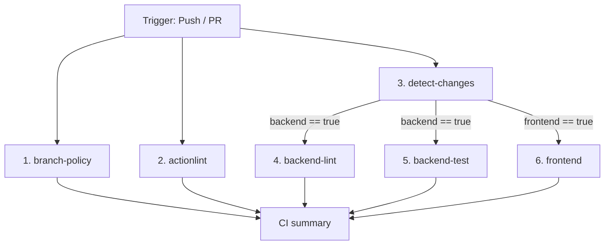

# Exposición DevOps — Estado Actual de CI/CD, Docker y Políticas de Ramas en KOSMO

## 1. Visión General del Componente DevOps

Este documento resume de forma **explicativa y actualizada (lista para la Wiki de Azure DevOps)** la arquitectura del componente DevOps del proyecto KOSMO:

1. **Pipeline de Integración Continua (CI)** — Auditoría de políticas de ramas, linting de workflows, detección de cambios por workspace, análisis estático y pruebas con bases de datos en contenedores.
2. **Pipeline de Despliegue Continuo (CD)** — Migraciones automáticas de base de datos con Alembic y despliegue del frontend en Vercel.
3. **Estrategia de Ramas y Azure Boards** — Integración trazable mediante `AB#ID` y convenciones Git Flow.
4. **Entorno de Desarrollo Local** — Orquestación multicapa con Docker Compose (PostgreSQL, MongoDB, Redis, FastAPI, Next.js/Bun).

---

## 2. Pipeline CI/CD: Estructura Completa

El repositorio cuenta con dos workflows orquestados en `.github/workflows/`:
- `ci.yml` (Continuous Integration)
- `cd.yml` (Continuous Deployment)

---

### 2.1 Continuous Integration (`.github/workflows/ci.yml`)

Se dispara automáticamente en:
- `push` hacia `main` o `develop`
- `pull_request` hacia `main` o `develop`
- `workflow_dispatch` (ejecución manual)

El pipeline de CI se compone de **6 trabajos (jobs) coordinados**:



#### 📌 Job 1: `branch-policy` (Validación de Ramas y Azure Boards)
- **Verificación de Flujo:** Garantiza que `main` solo reciba ramas `release/*` o `hotfix/*`, y `develop` reciba `feature/*`, `release/*` o `hotfix/*`.
- **Integración Azure Boards:** Obliga a que los títulos de Pull Request sigan el formato Conventional Commits con el ID del elemento de trabajo: `tipo(alcance): descripción AB#ID` (ej. `feat(chat): definir entidad MensajeChat AB#191`).

#### 📌 Job 2: `actionlint` (Linter de Workflows)
- Audita todos los archivos `.yml` de GitHub Actions usando `rhysd/actionlint-action@v1` para detectar errores de sintaxis o riesgos de inyección de scripts.

#### 📌 Job 3: `detect-changes` (Matriz Inteligente)
- Evalúa el `git diff` de la PR o Push. Si una PR solo modificó archivos de `frontend/`, omite la ejecución de las pruebas pesadas del backend y viceversa, optimizando los minutos de ejecución en GitHub.

#### 📌 Job 4: `backend-lint` (Linting y Tipado Estático de Backend)
- Corre en paralelo sin requerir bases de datos.
- Ejecuta `ruff format --check .`, `ruff check .` y `pyright` sobre Python 3.13.

#### 📌 Job 5: `backend-test` (Pruebas de Integración con Servicios Reales)
- Levanta contenedores aislados de **PostgreSQL 16**, **MongoDB 7** y **Redis 7** con chequeo de salud (`healthcheck`).
- Ejecuta `pytest tests --cov=kosmo` notificando cobertura de código XML y subiendo artefactos.

#### 📌 Job 6: `frontend` (Validación y Compilación Frontend)
- Configura **Bun 1.2.10** y gestiona la caché de Next.js (`.next/cache`).
- Ejecuta `bun run lint` (ESLint), `bun run tsc --noEmit` (TypeScript), Vitest (`bun run test`) y compilación para producción (`bun run build`).

#### 📌 Job 7: `ci-summary` (Resumen Ejecutivo y Gate de Fusión)
- Publica una tabla de resumen en `$GITHUB_STEP_SUMMARY`.
- Si alguno de los jobs requeridos falla, bloquea la fusión de la PR.

---

### 2.2 Continuous Deployment (`.github/workflows/cd.yml`)

Se dispara automáticamente cuando una PR hacia `main` se cierra como **merged**:

1. **`migrate-database`:** Conecta a la base de datos de producción (Supabase PostgreSQL) y aplica las migraciones con `uv run alembic upgrade head`.
2. **`deploy-frontend`:** Instala el CLI de Vercel y despliega el código del frontend optimizado.

---

## 3. Estrategia de Ramas y Convención de Commits

### Estrategia de Ramas (Git Flow)
- **`main`:** Rama de producción protegida.
- **`develop`:** Rama principal de integración para el sprint.
- **`feature/<nombre>-AB#ID`:** Ramas de características ligadas a Azure Boards.
- **`hotfix/<nombre>-AB#ID`:** Correcciones urgentes de producción.

### Formato Obligatorio de Mensaje de Commit:
```text
tipo(alcance): descripción breve en imperativo AB#ID
```
**Ejemplos:**
- `feat(chat): implementar persistencia dual del plan en zustand y backend AB#191`
- `fix(auth): corregir refresco de token expirado AB#145`
- `ci: optimizar deteccion de cambios en pipeline AB#191`

---

## 4. Docker Desktop y Desarrollo Local

El proyecto utiliza `docker-compose.yml` para levantar la pila completa localmente:

- **Frontend:** Next.js + Bun en puerto `3000` (con opción `NEXT_PUBLIC_USE_MOCKS: "true"` para modo mock).
- **Backend:** FastAPI + Uvicorn en puerto `8000`.
- **PostgreSQL:** Puerto `5432` con extensión `pgvector`.
- **Redis:** Puerto `6379` para caché y rate limiting.

### Comandos de Ejecución Local:
```bash
# Levantar stack completo
docker compose up -d --build

# Reiniciar solo el frontend
docker compose restart frontend
```
