# Refinamiento Sprint Backlog

## Stack Tecnológico

| Capa | Tecnología |
|---|---|
| Lenguaje Backend | Python 3.13 |
| Framework Backend | FastAPI 0.136+ |
| Lenguaje Frontend | TypeScript 5.x |
| Framework Frontend | Next.js 16 (App Router) |
| Base de Datos | PostgreSQL 17 (pgvector) |
| ORM | SQLAlchemy 2.0 (asíncrono) |
| Migraciones | Alembic |
| Validación Backend | Pydantic 2.7+ |
| Validación Frontend | Zod 4.x |
| Estado Frontend | Zustand 5.x |
| Estilos | Tailwind CSS 4.x |
| LLM/AI | pydantic-ai + LangGraph |
| Contenedores | Docker + Docker Compose |
| Arquitectura Backend | Hexagonal (Contratos → Dominio → Aplicación → Infraestructura) |
| Arquitectura Frontend | FSD (app → pages → widgets → entities → shared) |

---

## Glosario de Elementos del Sprint

| ID | Nombre | Tipo | HU donde aparece | Descripción |
|----|--------|------|-------------------|-------------|
| A1 | IngenieroSoftware | Actor | HU-01, HU-02, HU-03, HU-05, HU-06, HU-09 | Usuario principal que crea y visualiza productos software |
| B1 | CapturaContextoProyecto | Boundary | HU-01, HU-03 | Punto de entrada donde el ingeniero proporciona nombre y descripción del proyecto |
| B2 | VisualizacionPortafolio | Boundary | HU-02 | Punto de interacción que presenta el listado de proyectos en cuadrícula o lista |
| B3 | AccesoRapido | Boundary | HU-02 | Disparador para iniciar la creación de un nuevo proyecto desde el portafolio |
| B4 | ConfirmacionProcesamiento | Boundary | HU-03, HU-05, HU-09 | Indicador de procesamiento en curso que muestra el estado de la generación por IA |
| B5 | VisualizacionDescubrimiento | Boundary | HU-03, HU-05 | Punto de interacción para visualizar el documento de descubrimiento generado |
| B6 | GestionCaracteristicas | Boundary | HU-05, HU-06, HU-09 | Punto de interacción para visualizar el listado de características del proyecto |
| B7 | PropuestaAsistida | Boundary | HU-05 | Punto de interacción que presenta sugerencias de características generadas por IA |
| B8 | NavegacionTaxonomica | Boundary | HU-09 | Punto de interacción con panel dividido: selector de características y visor de requisitos |
| C1 | ValidarCamposProyecto | Control | HU-01 | Valida caracteres permitidos, longitudes y determina la habilitación del botón Generar |
| C2 | AlternarVistaPortafolio | Control | HU-02 | Orquesta la carga de proyectos y alterna entre vista de cuadrícula y vista de lista |
| C3 | ProcesarGeneracionDescubrimiento | Control | HU-03 | Orquesta la invocación a la IA para generar el documento de descubrimiento y maneja fallos |
| C4 | ProcesarGeneracionCaracteristicas | Control | HU-05 | Orquesta la generación inicial de cinco características, la sugerencia de tres adicionales y el guardado de las seleccionadas |
| C5 | FiltrarCaracteristicas | Control | HU-06 | Valida la entrada alfabética de búsqueda y filtra el listado de características por coincidencia de título |
| C6 | ProcesarGeneracionRequisitos | Control | HU-09 | Orquesta la generación de requisitos bajo el estándar EARS mediante IA para una característica seleccionada |
| E1 | Proyecto | Entity | HU-01, HU-02, HU-03 | Agregado raíz que representa un producto software con su nombre, descripción, fase y estado |
| E2 | DocumentoDescubrimiento | Entity | HU-03, HU-05 | Documento monolítico en formato Markdown con nueve secciones que describe la visión del producto |
| E3 | Caracteristica | Entity | HU-05, HU-06, HU-09 | Unidad funcional del producto software con identificador, título y descripción |
| E4 | Requisito | Entity | HU-09 | Requisito formal redactado bajo el estándar EARS asociado a una característica |

---

## HU-01 · Nuevo proyecto

### Card

| Elemento | Descripción |
|----------|-------------|
| Historia de Usuario | **Como** Ingeniero de Software **quiero** crear un proyecto **para** organizar productos software a descubrir |
| Estimación | 5 SP |

---

### Criterios de Aceptación

| N.° | Escenario | Criterio |
|---|---|---|
| CA-01  | **Intento de ingreso de caracteres no permitidos en el Nombre del Proyecto**  | **Dado que** el ingeniero de software se encuentra en la pantalla "Crear Proyecto", **cuando** intenta ingresar números, caracteres especiales o emojis en el campo "Nombre", **entonces** el sistema no permite la inserción de dicho carácter, **Y** mantiene únicamente los caracteres alfabéticos y espacios previamente ingresados |
| CA-02  | **Restricción de longitud máxima en el campo Nombre del Proyecto**  | **Dado que** el ingeniero de software se encuentra en la pantalla "Crear Proyecto", **cuando** ingresa texto hasta alcanzar el límite máximo de 25 caracteres en el campo "Nombre", **entonces** el sistema bloquea la inserción de nuevos caracteres en el campo |
| CA-03  | **Intento de ingreso de caracteres no permitidos en la Descripción del Proyecto**  | **Dado que** el ingeniero de software se encuentra en la pantalla "Crear Proyecto", **cuando** intenta ingresar números, caracteres especiales o emojis en el campo "Descripción", **entonces** el sistema no permite la inserción de dicho carácter, **Y** mantiene únicamente los caracteres alfabéticos y espacios previamente ingresados |
| CA-04  | **Restricción de longitud máxima en el campo Descripción del Proyecto**  | **Dado que** el ingeniero de software se encuentra en la pantalla "Crear Proyecto", **cuando** ingresa texto hasta alcanzar el límite máximo de 200 caracteres en el campo "Descripción", **entonces** el sistema bloquea la inserción de nuevos caracteres en el campo |
| CA-05  | **Deshabilitación del botón Generar por incumplimiento de longitud mínima**  | **Dado que** el ingeniero de software se encuentra en la pantalla "Crear Proyecto", **cuando** el campo "Nombre" tiene menos de 3 caracteres, **Y** el campo "Descripción" tiene menos de 50 caracteres, **entonces** el botón "Generar" permanece deshabilitado |
| CA-06  | **Activación del botón Generar por cumplimiento de validaciones**  | **Dado que** el ingeniero de software se encuentra en la sección "Crear Proyecto", **cuando** ingresa un texto de entre 3 y 25 caracteres válidos en el campo "Nombre", **E** ingresa un texto de entre 50 y 200 caracteres válidos en el campo "Descripción", **entonces** el botón "Generar" se habilita para recibir clics |

---

### Diagrama de Robustez

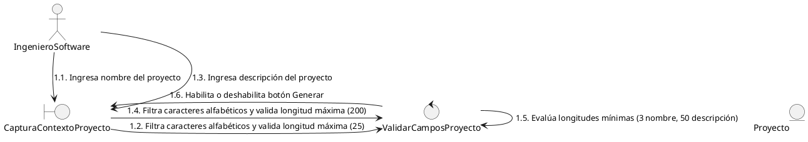

#### Leyenda

| ID | Elemento | Tipo | Descripción |
|----|----------|------|-------------|
| A1 | IngenieroSoftware | Actor | Ingeniero que crea un nuevo proyecto de software |
| B1 | CapturaContextoProyecto | Boundary | Punto de entrada donde el ingeniero proporciona nombre y descripción del proyecto |
| C1 | ValidarCamposProyecto | Control | Valida el filtro de caracteres alfabéticos, las longitudes mínima y máxima de cada campo, y determina la habilitación del botón Generar |
| E1 | Proyecto | Entity | Agregado raíz que representa el producto software a crear |

---

### Diagrama de Secuencia

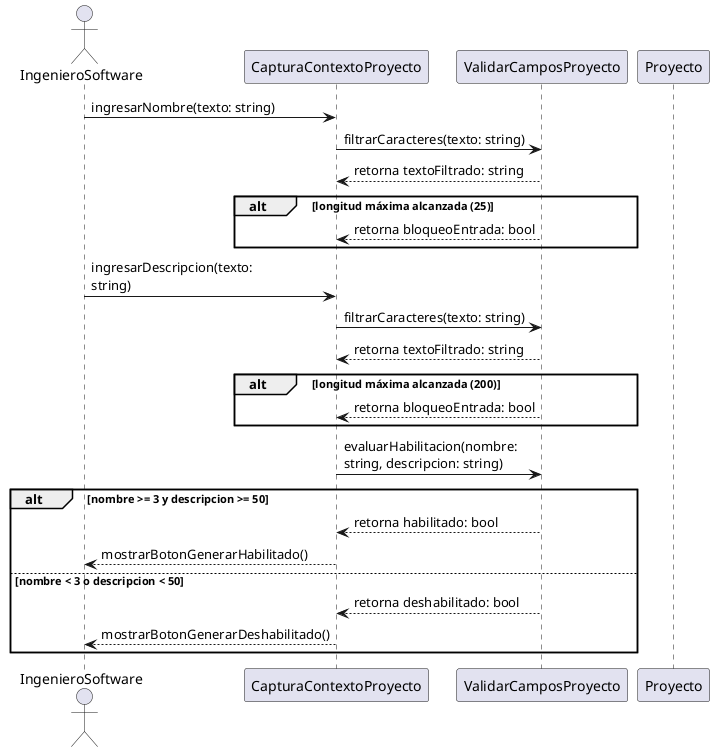

#### Leyenda de Contratos

| ID | Operación | Recibe | Retorna | Condición |
|----|-----------|--------|---------|-----------|
| B1 | CapturaContextoProyecto | nombre: string, descripcion: string | — | Principal |
| C1 | ValidarCamposProyecto | texto: string (filtrado) nombre: string, descripcion: string (evaluación) | textoFiltrado: string bloqueoEntrada: bool habilitado: bool | Principal |
| E1 | Proyecto | — | — | No participa en este flujo de validación |

---

### Matriz de Trazabilidad

| Tipo | Nombre | Tareas |
|------|--------|--------|
| Boundary | CapturaContextoProyecto | T6 |
| Control | ValidarCamposProyecto | — |
| Entity | Proyecto | T1, T2, T3, T4, T5 |

---

### Tareas HU-01

| N° | Tarea | Horas Esfuerzo |
|----|-------|----------------|
| T1 | Definir entidad Proyecto | 1.5H |
| T2 | Establecer puerto ProyectoRepository | 0.5H |
| T3 | Implementar ProyectoRepository (SQLAlchemy) | 1.5H |
| T4 | Desarrollar CreateProjectUseCase | 2H |
| T5 | Exponer router HTTP de proyectos | 1.5H |
| T6 | Construir componente ModalCreacionProyecto | 3.5H |

### Detalle de Tareas HU-01

| N° | Título | Descripción | Prioridad | Tipo de Actividad | Horas Esfuerzo |
|----|--------|-------------|-----------|-------------------|----------------|
| HU-01/T1 | Definir entidad Proyecto | Definir la entidad Proyecto en la capa de contratos con los atributos necesarios para representar un producto software: identificador, nombre, descripción, propietario, fase actual dentro del flujo de trabajo y estado del proyecto, junto con las marcas de tiempo correspondientes. | 1 | Desarrollo | 1.5H |
| HU-01/T2 | Establecer puerto ProyectoRepository | Definir la interfaz del repositorio como puerto en la capa de contratos con las operaciones necesarias para persistir y consultar proyectos. La capa de aplicación dependerá de esta abstracción, no de la implementación concreta. | 1 | Desarrollo | 0.5H |
| HU-01/T3 | Implementar ProyectoRepository (SQLAlchemy) | Construir la implementación del repositorio en la capa de infraestructura utilizando el ORM del proyecto para mapear la entidad de dominio a la tabla de base de datos correspondiente. Implementar las operaciones de persistencia definidas en el puerto con soporte asíncrono. | 1 | Desarrollo | 1.5H |
| HU-01/T4 | Desarrollar CreateProjectUseCase | Implementar el caso de uso en la capa de aplicación que orquesta la creación de un proyecto: recibir los datos de entrada, aplicar las reglas de negocio para construir la entidad con sus valores iniciales y delegar la persistencia al repositorio. | 1 | Desarrollo | 2H |
| HU-01/T5 | Exponer router HTTP de proyectos | Exponer los endpoints HTTP en la capa de infraestructura para la creación y consulta de proyectos. Configurar la validación de los datos de entrada y la inyección del caso de uso correspondiente desde la composición de dependencias. | 1 | Desarrollo | 1.5H |
| HU-01/T6 | Construir componente ModalCreacionProyecto | Construir el componente React ModalCreacionProyecto que renderiza una ventana emergente desde la pantalla de portafolio con dos campos de texto: "Nombre del Proyecto" (input con placeholder y maxLength=25) y "Descripción Inicial" (textarea con placeholder y maxLength=200). Implementar en el mismo componente la validación reactiva de caracteres: filtrar en cada onChange números, emojis y símbolos, conservando solo letras y espacios, con bloqueo de inserción al alcanzar la longitud máxima. Implementar la lógica de habilitación del botón "Generar": habilitar cuando nombre.length >= 3 y descripcion.length >= 50, mantener deshabilitado en cualquier otro caso. Al hacer clic en Generar, invocar el endpoint de creación de proyecto. | 2 | Desarrollo | 3.5H |

---

## HU-02 · Visualización del portafolio de proyectos

### Card

| Elemento | Descripción |
|----------|-------------|
| Historia de Usuario | **Como** Ingeniero de Software **quiero** visualizar el portafolio de proyectos **para** dar seguimiento a cada producto software |
| Estimación | 3 SP |

---

### Criterios de Aceptación

| N.° | Escenario | Criterio |
|---|---|---|
| CA-01  | **Visualización en vista de cuadrícula**  | **Dado que** el ingeniero de software está en la pantalla de "Proyectos" con la vista de lista activa, **cuando** da clic en el botón de vista de cuadrícula (ícono de 4 cuadros), **entonces** el sistema debe renderizar los proyectos en formato de tarjetas con los campos: "Proyecto", "Etapa", "Estado" y "Última actividad", **Y** debe incluir una tarjeta adicional para "Crear nuevo proyecto" |
| CA-02  | **Interacción para cambiar a vista de lista**  | **Dado que** el ingeniero de software está en la pantalla de "Proyectos" con la vista de cuadrícula activa, **cuando** da clic en el botón de vista de lista (icono de líneas horizontales), **entonces** el sistema debe renderizar los proyectos en formato de tabla con las columnas: "Proyecto", "Etapa", "Estado" y "Última actividad", **Y** debe incluir una fila adicional al final con un botón para "Crear nuevo Proyecto" |
| CA-03  | **Nuevo proyecto**  | **Dado que** el ingeniero de software está en la pantalla de "Proyectos", **cuando** da clic en "Crear nuevo proyecto", **entonces** el sistema debe cambiar a la pantalla "Crear Proyecto" |

---

### Diagrama de Robustez

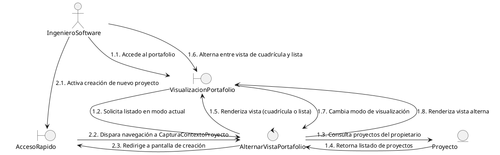

#### Leyenda

| ID | Elemento | Tipo | Descripción |
|----|----------|------|-------------|
| A1 | IngenieroSoftware | Actor | Ingeniero que visualiza y gestiona el portafolio de proyectos |
| B2 | VisualizacionPortafolio | Boundary | Punto de interacción que presenta el listado de proyectos en cuadrícula o tabla |
| B3 | AccesoRapido | Boundary | Disparador para iniciar la navegación hacia la creación de un nuevo proyecto |
| C2 | AlternarVistaPortafolio | Control | Orquesta la carga de proyectos desde el dominio y alterna entre los modos de visualización |
| E1 | Proyecto | Entity | Agregado raíz que contiene la información de cada proyecto registrado |

---

### Diagrama de Secuencia

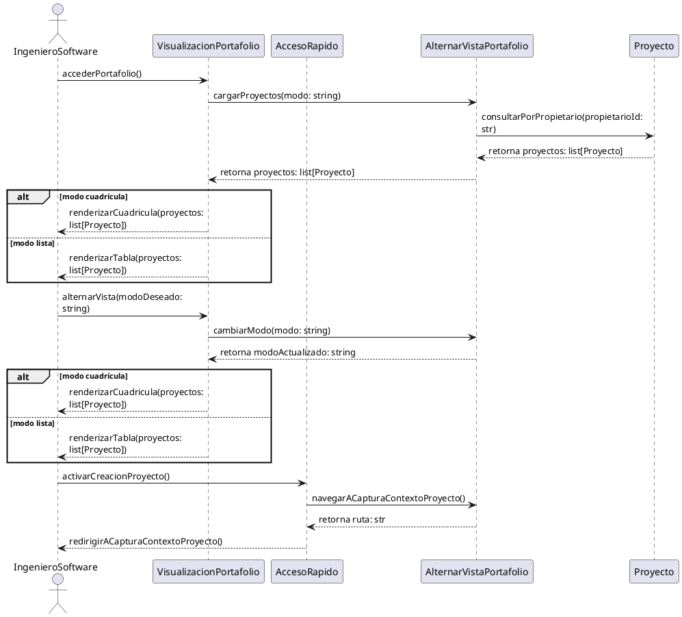

#### Leyenda de Contratos

| ID | Operación | Recibe | Retorna | Condición |
|----|-----------|--------|---------|-----------|
| B2 | VisualizacionPortafolio | modo: string | — | Principal |
| B3 | AccesoRapido | — | — | Principal |
| C2 | AlternarVistaPortafolio | modo: string (carga) modo: string (cambio) | proyectos: list[Proyecto] modoActualizado: string | Principal |
| E1 | Proyecto | propietarioId: str (consulta) | proyectos: list[Proyecto] | Principal |

---

### Matriz de Trazabilidad

| Tipo | Nombre | Tareas |
|------|--------|--------|
| Boundary | VisualizacionPortafolio | T3, T4, T5, T6 |
| Boundary | AccesoRapido | T7 |
| Control | AlternarVistaPortafolio | T1, T2 |

---

### Tareas HU-02

| N° | Tarea | Horas Esfuerzo |
|----|-------|----------------|
| T1 | Desarrollar ListProjectsUseCase | 1.5H |
| T2 | Exponer router HTTP GET proyectos | 1.5H |
| T3 | Construir barra WizardNavegacion | 2.5H |
| T4 | Construir panel BarraLateral | 3H |
| T5 | Configurar layout AppLayout | 2H |
| T6 | Desarrollar página PaginaPortafolio | 3H |
| T7 | Conectar botón de acceso a crear proyecto | 0.5H |

### Detalle de Tareas HU-02

| N° | Título | Descripción | Prioridad | Tipo de Actividad | Horas Esfuerzo |
|----|--------|-------------|-----------|-------------------|----------------|
| HU-02/T1 | Desarrollar ListProjectsUseCase | Implementar el caso de uso en la capa de aplicación que orquesta la consulta de proyectos pertenecientes al usuario autenticado. Recuperar la lista de entidades con sus metadatos principales y retornarla para su visualización en el portafolio. | 1 | Desarrollo | 1.5H |
| HU-02/T2 | Exponer router HTTP GET proyectos | Exponer el endpoint HTTP en la capa de infraestructura para el listado de proyectos. Configurar la autenticación requerida y la inyección del caso de uso correspondiente. | 1 | Desarrollo | 1.5H |
| HU-02/T3 | Construir barra WizardNavegacion | Construir el componente React WizardNavegacion fijo en la parte superior de todas las pantallas de fase. Renderizar las fases del flujo como pestañas interactivas [Descubrimiento] → [Características] → [Requisitos] → [Modelo] → [Implementación]. La fase activa se resalta visualmente y las fases ya completadas permiten navegación hacia atrás. Las fases no alcanzadas se muestran deshabilitadas. Utilizar next/navigation para los enlaces entre fases. | 1 | Desarrollo | 2.5H |
| HU-02/T4 | Construir panel BarraLateral | Construir el componente React BarraLateral colapsable (toggle mostrar/ocultar) presente globalmente en cualquier pantalla. Sección superior: identificador de la aplicación "KOSMO". Sección central: listado vertical de accesos directos a proyectos recientes consumiendo el endpoint de listado de proyectos. Sección inferior: foto y nombre del perfil del usuario autenticado, y botón de acción [Salir] que invoca el endpoint de logout. La barra se colapsa a un ancho mínimo mostrando solo iconos. | 1 | Desarrollo | 3H |
| HU-02/T5 | Configurar layout AppLayout | Configurar el AppLayout de Next.js en app/(app)/layout.tsx que compone la barra WizardNavegacion en la parte superior, el panel BarraLateral en el costado izquierdo, y el área de contenido principal donde se renderiza cada página de fase. Gestionar el estado de colapso de la BarraLateral y la redimensión del contenido. Incluir el Provider de Zustand para el proyecto activo. | 1 | Desarrollo | 2H |
| HU-02/T6 | Desarrollar página PaginaPortafolio | Desarrollar el componente React PaginaPortafolio que sirve como página contenedora de la pantalla de "Proyectos". Incluir el botón [+ Proyecto] en la esquina superior derecha y el conmutador de vista (ícono de 4 cuadros e ícono de líneas horizontales). Implementar la vista de cuadrícula con el componente TarjetaProyecto renderizando cada proyecto con los metadatos Proyecto, Etapa, Estado y Última actividad en formato relativo. Implementar la vista de lista con el componente FilaProyecto en formato tabla con las mismas columnas. Incluir en ambos modos un elemento adicional de acceso rápido "Crear nuevo Proyecto". Consumir el endpoint de listado de proyectos al montar. | 2 | Desarrollo | 3H |
| HU-02/T7 | Conectar botón de acceso a crear proyecto | Conectar la navegación desde el botón [+ Proyecto] y desde la tarjeta/fila "Crear nuevo Proyecto" hacia la apertura del componente ModalCreacionProyecto (construido en HU-01). Utilizar el enrutador de Next.js para gestionar el cambio de vista. | 2 | Desarrollo | 0.5H |

---

## HU-03 · Creación de la visión del producto software con IA

### Card

| Elemento | Descripción |
|----------|-------------|
| Historia de Usuario | **Como** Ingeniero de Software **quiero** crear la visión del producto software mediante IA **para** establecer el propósito y contexto de negocio del producto software |
| Estimación | 8 SP |

---

### Criterios de Aceptación

| N.° | Escenario | Criterio |
|---|---|---|
| CA-01  | **Generación exitosa de la visión**  | **Dado que** el ingeniero de software se encuentra en la pantalla "Crear Proyecto", **cuando** ingresa un nombre válido del producto en el campo "Nombre", **E** ingresa una descripción válida del producto en el campo "Descripción", **Y** da clic en el botón "Generar", **entonces** el sistema muestra el modal de "Generando Descripción General" con un mensaje "Optimizando la estructura de la Descripción General. Por favor, espera un momento", **Y** redirige a la pantalla "Descripción general del producto", **Y** despliega el documento con nueve secciones base: Visión del producto, Espacio del problema, Actores, Propuesta de valor, Casos de uso, Capacidades principales, Reglas de negocio, Atributos de calidad y Alcance |
| CA-02  | **Falla del servicio de IA al solicitar sugerencias**  | **Dado que** el ingeniero de software se encuentra en la pantalla "Crear Proyecto", **cuando** ingresa un nombre válido del producto en el campo "Nombre", **E** ingresa una descripción válida del producto en el campo "Descripción", **Y** da clic en el botón "Generar", **Y** el servicio de generación de IA no se encuentra disponible, **entonces** en el modal de "Generando Descripción General" se muestra el mensaje: "No se pudo generar las sugerencias. Por favor, inténtelo más tarde" |
| CA-03  | **Falla en la generación de sugerencias por saldo insuficiente en la API Key**  | **Dado que** el ingeniero de software se encuentra en la pantalla "Crear Proyecto", **cuando** ingresa un nombre válido del producto en el campo "Nombre", **E** ingresa una descripción válida del producto en el campo "Descripción", **Y** da clic en el botón "Generar", **Y** el servicio de IA ha alcanzado el límite de su plan de uso disponible, **entonces** en el modal de "Generando Descripción General" se muestra el mensaje: "No se pudo generar el descubrimiento. Verifica que la API Key configurada cuente con saldo disponible" |

---

### Diagrama de Robustez

```plantuml
@startuml
top to bottom direction
skinparam nodesep 50
skinparam ranksep 60
skinparam minClassWidth 140

actor "IngenieroSoftware" as A1

boundary "CapturaContextoProyecto" as B1
boundary "ConfirmacionProcesamiento" as B4
boundary "VisualizacionDescubrimiento" as B5

control "ProcesarGeneracionDescubrimiento" as C3

entity "Proyecto" as E1
entity "DocumentoDescubrimiento" as E2

' ===== BANDA 1 (Viaje 1: Generación del documento de descubrimiento) =====
A1 -[hidden]right-> B1
B1 -[hidden]right-> C3
C3 -[hidden]right-> E1

A1 -down-> B1 : "1.1. Activa botón Generar"
B1 -right-> C3 : "1.2. Envía nombre y descripción del proyecto"
C3 -right-> E1 : "1.3. Persiste el proyecto creado"
E1 -left-> C3 : "1.4. Confirma persistencia"
C3 -left-> B4 : "1.5a. Muestra indicador de procesamiento"
C3 -right-> C3 : "1.5b. Invoca KOSMOAgent en fase descubrimiento"
C3 -right-> E2 : "1.6a. Almacena documento generado (éxito)"
E2 -left-> C3 : "1.7a. Confirma almacenamiento"
C3 -left-> B4 : "1.6b. Muestra error de servicio no disponible"
C3 -left-> B4 : "1.6c. Muestra error de saldo insuficiente"
C3 -left-> B5 : "1.7b. Redirige a visualización del documento (éxito)"

' ===== BANDA 2 (Viaje 2: Visualización del documento generado) =====
B4 -[hidden]down-> B5

A1 -[hidden]down-> B5
B5 -[hidden]right-> C3

A1 -down-> B5 : "2.1. Visualiza las nueve secciones del documento"
B5 -right-> C3 : "2.2. Solicita contenido del documento"
C3 -right-> E2 : "2.3. Consulta documento del proyecto"
E2 -left-> C3 : "2.4. Retorna contenido markdown"
C3 -left-> B5 : "2.5. Renderiza secciones con navegación por anclas"
A1 -down-> B5 : "2.6. Navega entre secciones mediante índice lateral"
B5 -right-> C3 : "2.7. Desplaza vista a sección seleccionada"
C3 -left-> B5 : "2.8. Posiciona visor en la sección correspondiente"
A1 -down-> B5 : "2.9. Activa Generar características"
B5 -right-> C3 : "2.10. Dispara transición a fase de características"
@enduml
```

#### Leyenda

| ID | Elemento | Tipo | Descripción |
|----|----------|------|-------------|
| A1 | IngenieroSoftware | Actor | Ingeniero que genera y visualiza la visión del producto software |
| B1 | CapturaContextoProyecto | Boundary | Punto de entrada desde el cual se dispara la generación del descubrimiento |
| B4 | ConfirmacionProcesamiento | Boundary | Indicador del estado de la generación por IA durante el procesamiento |
| B5 | VisualizacionDescubrimiento | Boundary | Punto de interacción para visualizar el documento de descubrimiento con sus nueve secciones y navegar entre ellas |
| C3 | ProcesarGeneracionDescubrimiento | Control | Orquesta la persistencia del proyecto, la invocación a KOSMOAgent para generar el documento de nueve secciones, el manejo de fallos del servicio de IA y la consulta del documento para visualización |
| E1 | Proyecto | Entity | Agregado raíz que se persiste al iniciar la generación del descubrimiento |
| E2 | DocumentoDescubrimiento | Entity | Documento monolítico en formato Markdown que contiene las nueve secciones de la visión del producto |

---

### Diagrama de Secuencia

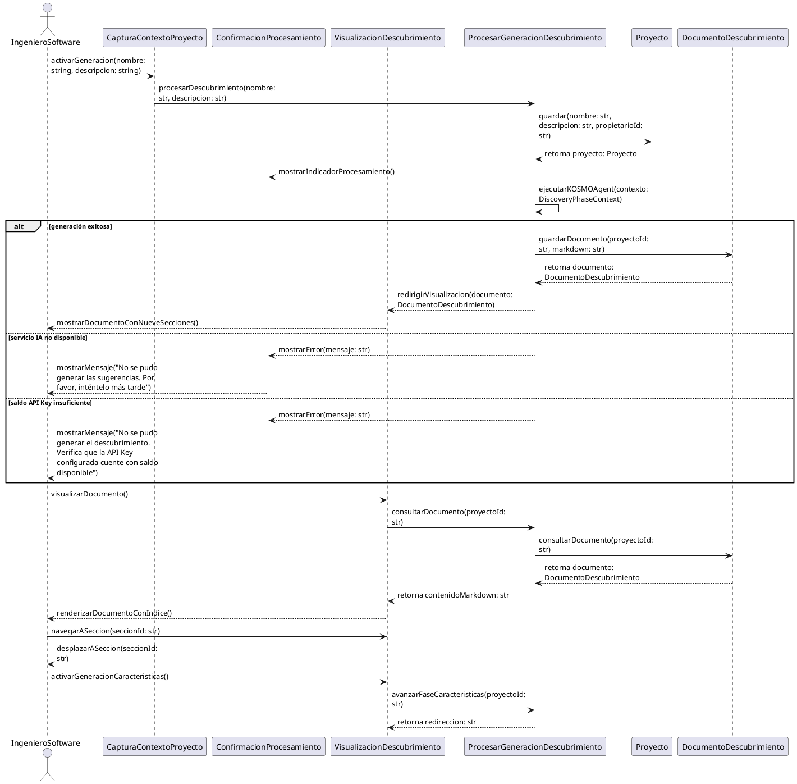

#### Leyenda de Contratos

| ID | Operación | Recibe | Retorna | Condición |
|----|-----------|--------|---------|-----------|
| B1 | CapturaContextoProyecto | nombre: string, descripcion: string | — | Principal |
| B4 | ConfirmacionProcesamiento | mensaje: str (error) | — | Procesamiento en curso o fallo |
| B5 | VisualizacionDescubrimiento | documento: DocumentoDescubrimiento (recepción) seccionId: str (navegación) | — | Principal |
| C3 | ProcesarGeneracionDescubrimiento | nombre: str, descripcion: str (generación) proyectoId: str (consulta) | proyecto: Proyecto documento: DocumentoDescubrimiento error: str contenidoMarkdown: str | Principal |
| E1 | Proyecto | nombre: str, descripcion: str, propietarioId: str | proyecto: Proyecto | Principal |
| E2 | DocumentoDescubrimiento | proyectoId: str, markdown: str (guardado) proyectoId: str (consulta) | documento: DocumentoDescubrimiento contenidoMarkdown: str | Principal |

---

### Matriz de Trazabilidad

| Tipo | Nombre | Tareas |
|------|--------|--------|
| Boundary | ConfirmacionProcesamiento | T12 |
| Boundary | VisualizacionDescubrimiento | T13 |
| Control | ProcesarGeneracionDescubrimiento | T1, T3, T4, T5, T6, T7, T8, T10 |
| Entity | DocumentoDescubrimiento | T2, T9, T11 |

---

### Tareas HU-03

| N° | Tarea | Horas Esfuerzo |
|----|-------|----------------|
| T1 | Establecer puertos LLMClient y PhaseMode | 2H |
| T2 | Definir entidad DocumentoDescubrimiento y su repositorio | 1.5H |
| T3 | Orquestar KOSMOAgent y ContextBuilder | 3.5H |
| T4 | Construir SequentialOrchestrator y guardrails | 2.5H |
| T5 | Elaborar DiscoveryMode | 2H |
| T6 | Desarrollar validadores de descubrimiento | 1.5H |
| T7 | Integrar adaptadores LLM (PydanticAI + Noop) | 2.5H |
| T8 | Configurar cableado de dependencias (composition.py) | 2.5H |
| T9 | Implementar DiscoveryDocumentRepository (SQLAlchemy) | 1.5H |
| T10 | Desarrollar GenerateDiscoveryUseCase | 1.5H |
| T11 | Exponer routers HTTP de descubrimiento | 2H |
| T12 | Construir modal ModalGeneracion | 2H |
| T13 | Construir panel VisorDescubrimiento con índice de navegación lateral | 3.5H |

### Detalle de Tareas HU-03

| N° | Título | Descripción | Prioridad | Tipo de Actividad | Horas Esfuerzo |
|----|--------|-------------|-----------|-------------------|----------------|
| HU-03/T1 | Establecer puertos LLMClient y PhaseMode | Definir en la capa de contratos las interfaces necesarias para la comunicación con el proveedor de LLM y para la orquestación de las fases del pipeline. Establecer el protocolo del cliente LLM con sus métodos de completado, los tipos de datos para prompts y respuestas, y el protocolo de modo de fase con los métodos que cada fase debe implementar. Incluir los tipos de contexto que cada fase recibe y los tipos de salida que produce. | 1 | Desarrollo | 2H |
| HU-03/T2 | Definir entidad DocumentoDescubrimiento y su repositorio | Definir en la capa de contratos la entidad que representa el documento de descubrimiento generado por la IA, con su contenido estructurado. Incluir la representación parseada del documento para su manipulación programática y el puerto del repositorio con las operaciones de persistencia y consulta necesarias. | 1 | Desarrollo | 1.5H |
| HU-03/T3 | Orquestar KOSMOAgent y ContextBuilder | Construir en la capa de dominio el componente central que orquesta las interacciones con el LLM para todas las fases del pipeline, con un ciclo de ejecución que construye el prompt, invoca al cliente LLM, valida la respuesta y reintenta con correcciones si la validación falla. Construir también el componente encargado de reunir y estructurar la información de contexto que cada fase necesita para construir sus prompts. | 1 | Desarrollo | 3.5H |
| HU-03/T4 | Construir SequentialOrchestrator y guardrails | Construir en la capa de dominio el orquestador que valida las transiciones entre fases del pipeline, imponiendo las reglas de avance. Implementar las barreras de calidad que detectan y corrigen términos técnicos indebidos en el texto generado por la IA, así como las funciones de conversión entre el formato de documento interno y el formato de intercambio y la generación de identificadores textuales a partir de nombres. | 1 | Desarrollo | 2.5H |
| HU-03/T5 | Elaborar DiscoveryMode | Elaborar en la capa de dominio el modo de fase para descubrimiento, definiendo las instrucciones que guían a la IA para generar un documento de negocio estructurado con las secciones requeridas, reglas de formato, prohibiciones de contenido y criterios mínimos de completitud. Implementar la construcción del prompt de usuario a partir del contexto del proyecto y la construcción del prompt de reintento que incorpora los errores de validaciones previas. | 1 | Desarrollo | 2H |
| HU-03/T6 | Desarrollar validadores de descubrimiento | Desarrollar en la capa de dominio las funciones de validación para la salida de la fase de descubrimiento. Verificar que el documento generado contenga todas las secciones requeridas con contenido suficiente y que cumpla con las reglas de calidad establecidas para el contenido de negocio. | 2 | Desarrollo | 1.5H |
| HU-03/T7 | Integrar adaptadores LLM (PydanticAI + Noop) | Integrar en la capa de infraestructura los adaptadores del puerto LLMClient. Construir un adaptador real que se comunique con el proveedor de LLM configurado, inyectando la clave de API desde la configuración. Construir un adaptador de desarrollo que retorne respuestas de ejemplo predefinidas para cada fase, permitiendo iterar sin consumir crédito del servicio. | 1 | Desarrollo | 2.5H |
| HU-03/T8 | Configurar cableado de dependencias (composition.py) | Configurar en la capa de infraestructura el punto central de composición de dependencias que construye y cablea todos los componentes durante el ciclo de vida de la aplicación. Seleccionar el adaptador LLM según la configuración, instanciar el agente con su cliente, construir el constructor de contexto con los repositorios, e instanciar cada caso de uso inyectando sus dependencias correspondientes. | 1 | Desarrollo | 2.5H |
| HU-03/T9 | Implementar DiscoveryDocumentRepository (SQLAlchemy) | Construir la implementación del repositorio en la capa de infraestructura utilizando el ORM del proyecto para persistir y consultar los documentos de descubrimiento. Implementar las operaciones definidas en el puerto con soporte asíncrono. | 1 | Desarrollo | 1.5H |
| HU-03/T10 | Desarrollar GenerateDiscoveryUseCase | Implementar el caso de uso en la capa de aplicación que orquesta la generación del documento de descubrimiento mediante IA. Persistir el proyecto, delegar en el agente la generación del documento a partir del contexto construido, almacenar el resultado y gestionar los posibles fallos del servicio de IA durante el proceso. | 1 | Desarrollo | 1.5H |
| HU-03/T11 | Exponer routers HTTP de descubrimiento | Exponer los endpoints HTTP en la capa de infraestructura para la generación y consulta del documento de descubrimiento. Configurar la autenticación requerida y la inyección de los casos de uso correspondientes desde la composición de dependencias. | 2 | Desarrollo | 2H |
| HU-03/T12 | Construir modal ModalGeneracion | Construir el componente React ModalGeneracion que se despliega tras hacer clic en el botón Generar de ModalCreacionProyecto. Durante el procesamiento exitoso, mostrar el mensaje "Optimizando la estructura de la Descripción General. Por favor, espera un momento" con un indicador visual de progreso. Al completar la generación, cerrar el modal y redirigir a la página de descubrimiento. En caso de error del servicio de IA, mostrar dentro del mismo modal los mensajes diferenciados: "No se pudo generar las sugerencias. Por favor, inténtelo más tarde" para servicio no disponible, y "No se pudo generar el descubrimiento. Verifica que la API Key configurada cuente con saldo disponible" para saldo insuficiente. | 2 | Desarrollo | 2H |
| HU-03/T13 | Construir panel VisorDescubrimiento con índice de navegación lateral | Construir el componente React VisorDescubrimiento que renderiza el contenido markdown del documento de descubrimiento en formato visual enriquecido. Consumir el endpoint de consulta del descubrimiento al montar. Incluir el índice de navegación como panel lateral izquierdo que lista las nueve secciones del documento como enlaces cliqueables. Al hacer clic en un ítem del índice, ejecutar scroll animado hacia la sección correspondiente utilizando anclas HTML. Resaltar visualmente la sección activa según la posición de scroll. | 2 | Desarrollo | 3.5H |

---

## HU-05 · Creación de las características del producto software con IA

### Card

| Elemento | Descripción |
|----------|-------------|
| Historia de Usuario | **Como** Ingeniero de Software **quiero** crear las características del producto software mediante IA **para** dividir la complejidad del producto software en unidades funcionales |
| Estimación | 8 SP |

---

### Criterios de Aceptación

| N.° | Escenario | Criterio |
|---|---|---|
| CA-01  | **Generación automática de características al inicializar la fase**  | **Dado que** el ingeniero de software se encuentra en la pantalla "Descripción del Producto" con el documento de la fase de descubrimiento guardado, **cuando** hace clic en el botón "Generar características", **entonces** el sistema procesa de forma automática el documento previo mediante la IA, **Y** redirige al usuario a la pantalla "Características", **Y** despliega el listado inicial con exactamente cinco características generadas automáticamente para el proyecto |
| CA-02  | **Solicitud de nuevas propuestas de características a la IA**  | **Dado que** el ingeniero de software se encuentra en la pantalla "Características", **cuando** da clic en el botón "Característica", **entonces** el sistema realiza una petición a la IA para analizar el documento de la fase de Descubrimiento, **Y** despliega un modal que presenta exactamente tres nuevas propuestas de características que no existen previamente en el proyecto |
| CA-03  | **Integración de características sugeridas por la IA**  | **Dado que** el ingeniero de software se encuentra en la pantalla "Características" visualizando el modal con las tres propuestas sugeridas por la IA, **cuando** selecciona la/s característica/s que decide implementar, **Y** da clic en el botón "Agregar", **entonces** el sistema debe añadir la/s característica/s a la lista existente, **Y** renderizarla/s en la lista de características del proyecto |
| CA-04  | **Rechazo de la sugerencia**  | **Dado que** el ingeniero de software se encuentra en la pantalla "Características" visualizando el modal con las tres propuestas sugeridas por la IA, **cuando** da clic en el botón "X" de cerrar, **entonces** el sistema cierra el modal, **Y** no añade ningún nuevo registro ni aplica modificaciones al listado de características del proyecto |
| CA-05  | **Falla del servicio de IA al solicitar sugerencias**  | **Dado que** el ingeniero de software se encuentra en la pantalla "Características", **cuando** da clic en el botón "Característica", **Y** el servicio de generación de IA no se encuentra disponible, **entonces** el modal de sugerencias se muestra el mensaje: "No se pudo generar las sugerencias. Por favor, inténtelo más tarde" |
| CA-06  | **Falla en la generación de sugerencias por saldo insuficiente en la API Key**  | **Dado que** el ingeniero de software se encuentra en la pantalla "Características", **cuando** da clic en el botón "Característica", **Y** el servicio de IA ha alcanzado el límite de su plan de uso disponible, **entonces** el modal de sugerencias muestra el mensaje: "No se pudo generar las sugerencias. Verifica que la API Key configurada cuente con saldo disponible" |

---

### Diagrama de Robustez

```plantuml
@startuml
top to bottom direction
skinparam nodesep 50
skinparam ranksep 60
skinparam minClassWidth 140

actor "IngenieroSoftware" as A1

boundary "VisualizacionDescubrimiento" as B5
boundary "GestionCaracteristicas" as B6
boundary "PropuestaAsistida" as B7

control "ProcesarGeneracionCaracteristicas" as C4

entity "DocumentoDescubrimiento" as E2
entity "Caracteristica" as E3

' ===== BANDA 1 (Viaje 1: Generación inicial de cinco características) =====
A1 -[hidden]right-> B5
B5 -[hidden]right-> C4
C4 -[hidden]right-> E2

A1 -down-> B5 : "1.1. Activa Generar características"
B5 -right-> C4 : "1.2. Solicita generación inicial"
C4 -right-> E2 : "1.3. Lee documento de descubrimiento"
E2 -left-> C4 : "1.4. Retorna contenido del documento"
C4 -right-> E3 : "1.5. Almacena cinco características iniciales"
E3 -left-> C4 : "1.6. Confirma persistencia"
C4 -left-> B6 : "1.7. Redirige a gestión de características"

' ===== BANDA 2 (Viaje 2: Solicitud de tres sugerencias adicionales) =====
B5 -[hidden]down-> B6
B6 -[hidden]down-> B7

A1 -[hidden]down-> B6
B6 -[hidden]right-> C4

A1 -down-> B6 : "2.1. Activa botón +Característica"
B6 -right-> C4 : "2.2. Solicita sugerencias adicionales"
C4 -right-> E2 : "2.3. Lee documento de descubrimiento"
E2 -left-> C4 : "2.4. Retorna contenido"
C4 -right-> E3 : "2.5. Consulta características existentes"
E3 -left-> C4 : "2.6. Retorna listado actual"

' ===== BANDA 3 (Viaje 3: Integración y Viaje 4: Rechazo) =====
B7 -[hidden]right-> C4
C4 -[hidden]right-> E3

C4 -left-> B7 : "2.7a. Presenta tres sugerencias (éxito)"
C4 -left-> B7 : "2.7b. Muestra error de servicio"
C4 -left-> B7 : "2.7c. Muestra error de saldo"

A1 -down-> B7 : "3.1. Selecciona características y activa Agregar"
B7 -right-> C4 : "3.2. Guarda características seleccionadas"
C4 -right-> E3 : "3.3. Persiste nuevas características"
E3 -left-> C4 : "3.4. Confirma inserción"
C4 -left-> B6 : "3.5. Actualiza listado de características"

A1 -down-> B7 : "4.1. Activa botón X de cerrar"
B7 -right-> C4 : "4.2. Descarta sugerencias"
C4 -left-> B7 : "4.3. Cierra modal sin cambios"
@enduml
```

#### Leyenda

| ID | Elemento | Tipo | Descripción |
|----|----------|------|-------------|
| A1 | IngenieroSoftware | Actor | Ingeniero que visualiza las características generadas del producto |
| B5 | VisualizacionDescubrimiento | Boundary | Punto de interacción desde el cual se dispara la generación inicial de características |
| B6 | GestionCaracteristicas | Boundary | Punto de interacción para visualizar el listado de características, con barra de búsqueda y acciones |
| B7 | PropuestaAsistida | Boundary | Punto de interacción que presenta sugerencias de características generadas por IA con selector múltiple |
| C4 | ProcesarGeneracionCaracteristicas | Control | Orquesta la generación inicial de cinco características mediante KOSMOAgent, la sugerencia de tres adicionales, el guardado de las seleccionadas y el descarte de sugerencias, incluyendo el manejo de fallos del servicio de IA |
| E2 | DocumentoDescubrimiento | Entity | Documento de la fase de descubrimiento que la IA analiza para inferir características |
| E3 | Caracteristica | Entity | Unidad funcional del producto con identificador incremental, título y descripción |

---

### Diagrama de Secuencia

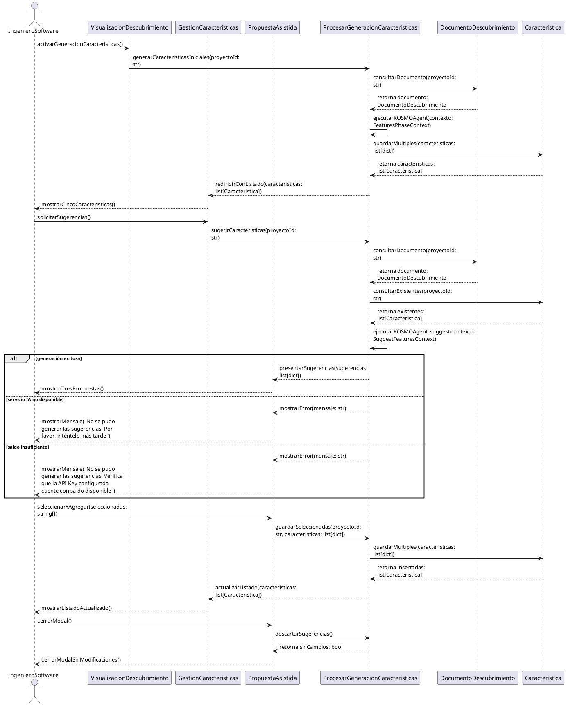

#### Leyenda de Contratos

| ID | Operación | Recibe | Retorna | Condición |
|----|-----------|--------|---------|-----------|
| B5 | VisualizacionDescubrimiento | — | — | Principal |
| B6 | GestionCaracteristicas | caracteristicas: list[Caracteristica] | — | Principal |
| B7 | PropuestaAsistida | sugerencias: list[dict] seleccionadas: string[] | — | Principal |
| C4 | ProcesarGeneracionCaracteristicas | proyectoId: str | caracteristicas: list[Caracteristica] sugerencias: list[dict] error: str | Principal |
| E2 | DocumentoDescubrimiento | proyectoId: str (consulta) | documento: DocumentoDescubrimiento | Principal |
| E3 | Caracteristica | caracteristicas: list[dict] (guardado) proyectoId: str (consulta) | caracteristicas: list[Caracteristica] existentes: list[Caracteristica] | Principal |

---

### Matriz de Trazabilidad

| Tipo | Nombre | Tareas |
|------|--------|--------|
| Boundary | GestionCaracteristicas | T6 |
| Boundary | PropuestaAsistida | T7 |
| Control | ProcesarGeneracionCaracteristicas | T3, T4 |
| Entity | Caracteristica | T1, T2, T5 |

---

### Tareas HU-05

| N° | Tarea | Horas Esfuerzo |
|----|-------|----------------|
| T1 | Definir entidad Caracteristica y FeatureRepository | 1.5H |
| T2 | Implementar FeatureRepository (SQLAlchemy) | 1.5H |
| T3 | Elaborar FeaturesMode y sus validadores | 2.5H |
| T4 | Desarrollar GenerateFeaturesUseCase y SuggestFeaturesUseCase | 2H |
| T5 | Exponer routers HTTP de características | 2H |
| T6 | Construir componente ListadoCaracteristicas | 2.5H |
| T7 | Construir modal ModalSugerenciaCaracteristicas | 2.5H |

### Detalle de Tareas HU-05

| N° | Título | Descripción | Prioridad | Tipo de Actividad | Horas Esfuerzo |
|----|--------|-------------|-----------|-------------------|----------------|
| HU-05/T1 | Definir entidad Caracteristica y FeatureRepository | Definir en la capa de contratos la entidad que representa una característica del producto software, con sus atributos de identificación, título, descripción, proyecto al que pertenece y trazabilidad hacia las secciones del descubrimiento que la originaron. Incluir el identificador visible para el usuario. Definir el puerto del repositorio con las operaciones de persistencia, consulta y verificación de duplicados necesarias. | 1 | Desarrollo | 1.5H |
| HU-05/T2 | Implementar FeatureRepository (SQLAlchemy) | Construir la implementación del repositorio en la capa de infraestructura utilizando el ORM del proyecto para persistir y consultar las características. Implementar las operaciones de persistencia masiva, las consultas necesarias para la visualización del listado y la lógica para evitar duplicados y asignar numeración incremental. | 1 | Desarrollo | 1.5H |
| HU-05/T3 | Elaborar FeaturesMode y sus validadores | Elaborar en la capa de dominio el modo de fase para características, definiendo las instrucciones que guían a la IA para descomponer el documento de descubrimiento en características funcionales, cada una con título, descripción, justificación y trazabilidad. Implementar la construcción del prompt de usuario incluyendo el contenido del descubrimiento y los títulos existentes para evitar duplicados. Desarrollar los validadores que verifican la estructura y la no redundancia semántica entre las características generadas. | 1 | Desarrollo | 2.5H |
| HU-05/T4 | Desarrollar GenerateFeaturesUseCase y SuggestFeaturesUseCase | Implementar en la capa de aplicación los casos de uso para la fase de características: la generación inicial a partir del documento de descubrimiento, la sugerencia de características adicionales que no dupliquen las existentes, y el guardado de las que el usuario seleccione. Cada caso de uso orquesta la construcción del contexto, la delegación al agente y la persistencia o retorno según corresponda. | 1 | Desarrollo | 2H |
| HU-05/T5 | Exponer routers HTTP de características | Exponer los endpoints HTTP en la capa de infraestructura para la generación inicial, sugerencia, guardado y consulta de características. Configurar la autenticación requerida y la inyección de los casos de uso correspondientes desde la composición de dependencias. | 2 | Desarrollo | 2H |
| HU-05/T6 | Construir componente ListadoCaracteristicas | Construir el componente React ListadoCaracteristicas que renderiza la lista de características del proyecto obtenidas del endpoint de consulta. Cada ítem muestra el identificador visible (C01, C02...), el título y la descripción. Incluir en la barra de herramientas superior: a la izquierda el componente BarraBusqueda (construido en HU-06), y a la derecha el botón [+ Característica] que abre ModalSugerenciaCaracteristicas y el botón [→ Requisitos] que redirige a la fase de requisitos. | 2 | Desarrollo | 2.5H |
| HU-05/T7 | Construir modal ModalSugerenciaCaracteristicas | Construir el componente React ModalSugerenciaCaracteristicas que se abre al hacer clic en [+ Característica]. Invoca el endpoint de sugerencia y presenta un modal con exactamente tres propuestas de características generadas por la IA, cada una con su título y descripción. Incluir checkboxes para selección múltiple. Botón [Agregar]: envía las seleccionadas al endpoint de guardado y actualiza el listado. Botón [X]: cierra sin modificar. En caso de error del servicio de IA, mostrar dentro del modal los mensajes diferenciados: "No se pudo generar las sugerencias. Por favor, inténtelo más tarde" o "No se pudo generar las sugerencias. Verifica que la API Key configurada cuente con saldo disponible". | 2 | Desarrollo | 2.5H |

---

## HU-06 · Explorar características del proyecto de software

### Card

| Elemento | Descripción |
|----------|-------------|
| Historia de Usuario | **Como** Ingeniero de Software **quiero** explorar características específicas del producto software **para** localizar las unidades funcionales de interés |
| Estimación | 2 SP |

---

### Criterios de Aceptación

| N.° | Escenario | Criterio |
|---|---|---|
| CA-01  | **Filtrado exitoso por coincidencias**  | **Dado que** el ingeniero de software se encuentra en la pantalla "Características" con un listado de características previamente registradas, **cuando** ingresa texto alfabético en la barra de búsqueda, **entonces** el sistema filtra las características evaluando la coincidencia sobre el título de cada elemento, **Y** mantiene visibles únicamente aquellas características cuyo título coincida con el texto ingresado |
| CA-02  | **Búsqueda sin resultados**  | **Dado que** el ingeniero de software se encuentra en la pantalla "Características" con el listado de características del proyecto, **cuando** ingresa texto alfabético en la barra de búsqueda, **Y** ninguna de las características registradas contiene dicho texto en su título, **entonces** el sistema oculta todas las características, **Y** muestra en pantalla el mensaje: "No se encontraron características que coincidan con su búsqueda" |
| CA-03  | **Restauración del listado al limpiar búsqueda**  | **Dado que** el ingeniero de software se encuentra en la pantalla "Características" visualizando resultados filtrados, **cuando** borra todo el texto ingresado en la barra de búsqueda, **entonces** el sistema remueve el filtro de la vista, **Y** despliega nuevamente el listado completo de características registradas en el proyecto |
| CA-04  | **Intento de ingreso de caracteres no permitidos en la barra de búsqueda**  | **Dado que** el ingeniero de software se encuentra en la pantalla "Características", **cuando** intenta ingresar números o caracteres especiales en la barra de búsqueda, **entonces** el sistema no permite la inserción de dichos caracteres, **Y** conserva intacto el texto alfabético válido previamente ingresado |

---

### Diagrama de Robustez

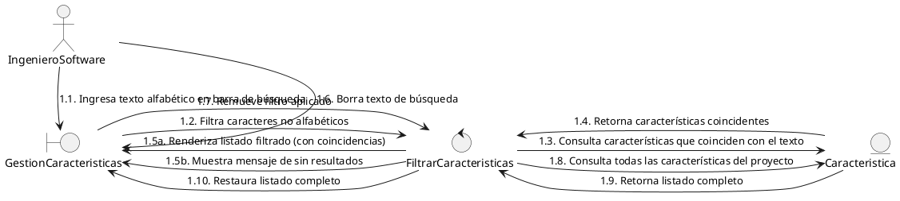

#### Leyenda

| ID | Elemento | Tipo | Descripción |
|----|----------|------|-------------|
| A1 | IngenieroSoftware | Actor | Ingeniero que explora y busca características específicas del proyecto |
| B6 | GestionCaracteristicas | Boundary | Punto de interacción que presenta el listado de características con barra de búsqueda |
| C5 | FiltrarCaracteristicas | Control | Filtra la entrada del usuario para aceptar solo texto alfabético, evalúa coincidencias por título y gestiona la restauración del listado completo |
| E3 | Caracteristica | Entity | Unidad funcional del producto software cuyo título es objeto de búsqueda |

---

### Diagrama de Secuencia

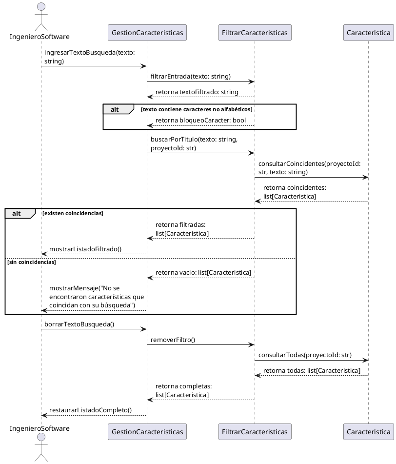

#### Leyenda de Contratos

| ID | Operación | Recibe | Retorna | Condición |
|----|-----------|--------|---------|-----------|
| B6 | GestionCaracteristicas | texto: string (búsqueda y borrado) | — | Principal |
| C5 | FiltrarCaracteristicas | texto: string (filtrado de entrada) texto: string, proyectoId: str (búsqueda) | textoFiltrado: string bloqueoCaracter: bool coincidentes: list[Caracteristica] vacio: list[Caracteristica] | Principal |
| E3 | Caracteristica | proyectoId: str, texto: string (consulta filtrada) proyectoId: str (consulta completa) | coincidentes: list[Caracteristica] todas: list[Caracteristica] | Principal |

---

### Matriz de Trazabilidad

| Tipo | Nombre | Tareas |
|------|--------|--------|
| Boundary | GestionCaracteristicas | T1 |
| Control | FiltrarCaracteristicas | T2, T3 |

---

### Tareas HU-06

| N° | Tarea | Horas Esfuerzo |
|----|-------|----------------|
| T1 | Construir componente BarraBusqueda | 1.5H |
| T2 | Ejecutar filtrado de características por título | 1.5H |
| T3 | Gestionar estado de búsqueda sin resultados y restauración del listado | 2H |

### Detalle de Tareas HU-06

| N° | Título | Descripción | Prioridad | Tipo de Actividad | Horas Esfuerzo |
|----|--------|-------------|-----------|-------------------|----------------|
| HU-06/T1 | Construir componente BarraBusqueda | Construir el componente React BarraBusqueda que se integra en la barra de herramientas de ListadoCaracteristicas (lado izquierdo). Implementar un filtro en el evento onChange que bloquea en tiempo real la inserción de números y caracteres especiales, conservando exclusivamente texto alfabético y espacios. El valor filtrado se propaga para actualizar reactivamente el listado visible mediante la función de filtrado por título. | 2 | Desarrollo | 1.5H |
| HU-06/T2 | Ejecutar filtrado de características por título | Implementar la función de filtrado del lado del cliente que recibe el listado completo de características y aplica un filtro por coincidencia parcial sin distinción de mayúsculas del texto de búsqueda sobre el título de cada característica. La función retorna el subconjunto filtrado de características o una lista vacía si no hay coincidencias. El filtrado se ejecuta de forma reactiva ante cada cambio en el texto de búsqueda. | 2 | Desarrollo | 1.5H |
| HU-06/T3 | Gestionar estado de búsqueda sin resultados y restauración del listado | Implementar dentro de ListadoCaracteristicas la gestión de los estados de la búsqueda. Cuando el filtro no produce coincidencias: ocultar la lista de características y mostrar el mensaje "No se encontraron características que coincidan con su búsqueda". Cuando el usuario borra completamente el texto de la BarraBusqueda: remover el filtro aplicado y restaurar el listado completo de características sin realizar una nueva consulta al servidor. | 3 | Desarrollo | 2H |

---

## HU-09 · Creación de requisitos del producto software mediante IA

### Card

| Elemento | Descripción |
|----------|-------------|
| Historia de Usuario | **Como** Ingeniero de Software **quiero** crear los requisitos de una característica mediante IA **para** establecer el comportamiento esperado de dicha característica |
| Estimación | 8 SP |

---

### Criterios de Aceptación

| N.° | Escenario | Criterio |
|---|---|---|
| CA-01  | **Visualización del estado inicial de la pantalla "Requisitos" (sin selección)**  | **Dado que** el ingeniero de software se encuentra en la pantalla "Características", **cuando** da clic en el botón "Requisitos", **entonces** el sistema redirige al usuario a la pantalla de "Requisitos", **Y** en el panel derecho se muestra el mensaje "Selecciona una característica del listado lateral para ver su detalle o generar nuevos requisitos" |
| CA-02  | **Visualización de una característica seleccionada sin requisitos generados**  | **Dado que** el ingeniero de software se encuentra en la pantalla "Requisitos", **cuando** da clic en una característica por primera vez en el panel izquierdo, **entonces** el panel derecho despliega el mensaje "Sin requisitos generados" y un botón de "Generar" |
| CA-03  | **Ejecución del proceso de generación de requisitos por la IA**  | **Dado que** el ingeniero de software ha seleccionado una característica que no posee requisitos previos en la pantalla "Requisitos", **cuando** da clic en el botón "Generar" del panel derecho, **entonces** el sistema muestra un modal de carga que bloquea la interacción con la interfaz, **Y** la IA procesa la característica para generar los requisitos bajo el estándar EARS, **Y** el sistema despliega el contenido generado en el panel derecho |
| CA-04  | **Falla del servicio de IA al solicitar requisitos**  | **Dado que** el ingeniero de software ha seleccionado una característica sin requisitos previos en la pantalla "Requisitos", **cuando** hace clic en el botón "Generar" del panel derecho, **Y** el servicio de inteligencia artificial no se encuentra disponible, **entonces** el sistema muestra un mensaje de error en el modal: "No se pudieron generar los requisitos. Por favor, inténtelo más tarde" |
| CA-05  | **Falla en la generación de requisitos por saldo insuficiente en la API Key**  | **Dado que** el ingeniero de software ha seleccionado una característica sin requisitos previos en la pantalla "Requisitos", **cuando** hace clic en el botón "Generar" del panel derecho, **Y** la API de IA ha alcanzado el límite de su plan de uso o saldo, **entonces** el sistema muestra un mensaje de error en el modal: "No se pudieron generar los requisitos. Verifica que la API Key configurada cuente con saldo disponible" |

---

### Diagrama de Robustez

```plantuml
@startuml
top to bottom direction
skinparam nodesep 50
skinparam ranksep 60
skinparam minClassWidth 140

actor "IngenieroSoftware" as A1

boundary "GestionCaracteristicas" as B6
boundary "NavegacionTaxonomica" as B8
boundary "ConfirmacionProcesamiento" as B4

control "ProcesarGeneracionRequisitos" as C6

entity "Caracteristica" as E3
entity "Requisito" as E4

' ===== BANDA 1 (Viaje 1: Navegación a requisitos sin selección) =====
A1 -[hidden]right-> B6
B6 -[hidden]right-> C6
C6 -[hidden]right-> E3

A1 -down-> B6 : "1.1. Activa botón Requisitos"
B6 -right-> C6 : "1.2. Redirige a fase de requisitos"
C6 -left-> B8 : "1.3. Muestra panel dividido con marcador de posición inicial"

' ===== BANDA 2 (Viaje 2: Selección de característica sin requisitos) =====
B6 -[hidden]down-> B8

A1 -[hidden]down-> B8
B8 -[hidden]right-> C6

A1 -down-> B8 : "2.1. Selecciona característica del panel izquierdo"
B8 -right-> C6 : "2.2. Consulta detalle y requisitos de la característica"
C6 -right-> E3 : "2.3. Obtiene datos de la característica"
E3 -left-> C6 : "2.4. Retorna característica"
C6 -right-> E4 : "2.5. Verifica existencia de requisitos previos"
E4 -left-> C6 : "2.6. Retorna sin requisitos"
C6 -left-> B8 : "2.7. Muestra Sin requisitos generados y botón Generar"

' ===== BANDA 3 (Viaje 3: Generación de requisitos con IA) =====
B8 -[hidden]down-> B4

A1 -[hidden]down-> B4
B4 -[hidden]right-> C6
C6 -[hidden]right-> E4

A1 -down-> B8 : "3.1. Activa botón Generar en panel derecho"
B8 -right-> C6 : "3.2. Solicita generación de requisitos EARS"
C6 -left-> B4 : "3.3a. Muestra modal de carga bloqueante"
C6 -right-> E3 : "3.3b. Lee detalle de la característica"
E3 -left-> C6 : "3.4. Retorna datos de la característica"
C6 -right-> C6 : "3.5. Invoca KOSMOAgent en fase requisitos"
C6 -right-> E4 : "3.6a. Almacena requisitos generados (éxito)"
E4 -left-> C6 : "3.7a. Confirma persistencia"
C6 -left-> B4 : "3.7b. Muestra error de servicio no disponible"
C6 -left-> B4 : "3.7c. Muestra error de saldo insuficiente"
C6 -left-> B8 : "3.8. Despliega requisitos en visor del panel derecho (éxito)"

' ===== BANDA 4 (Viaje 4: Visualización de requisitos generados) =====
B4 -[hidden]down-> B8

A1 -[hidden]down-> B8
B8 -[hidden]right-> C6

A1 -down-> B8 : "4.1. Visualiza requisitos en panel derecho"
B8 -right-> C6 : "4.2. Solicita contenido de requisitos"
C6 -right-> E4 : "4.3. Consulta requisitos de la característica"
E4 -left-> C6 : "4.4. Retorna contenido markdown"
C6 -left-> B8 : "4.5. Renderiza requisitos con índice de navegación EARS"
A1 -down-> B8 : "4.6. Navega entre grupos taxonómicos EARS mediante índice"
@enduml
```

#### Leyenda

| ID | Elemento | Tipo | Descripción |
|----|----------|------|-------------|
| A1 | IngenieroSoftware | Actor | Ingeniero que genera y visualiza requisitos bajo el estándar EARS |
| B6 | GestionCaracteristicas | Boundary | Punto de interacción desde el cual se dispara la navegación a la fase de requisitos |
| B8 | NavegacionTaxonomica | Boundary | Punto de interacción con panel dividido: selector de características a la izquierda y visor de requisitos a la derecha |
| B4 | ConfirmacionProcesamiento | Boundary | Indicador de procesamiento que bloquea la interacción durante la generación de requisitos por IA |
| C6 | ProcesarGeneracionRequisitos | Control | Orquesta la consulta de características, la invocación a KOSMOAgent para generar requisitos EARS, el manejo de fallos del servicio y la consulta de requisitos para visualización |
| E3 | Caracteristica | Entity | Unidad funcional cuya descripción alimenta la generación de requisitos |
| E4 | Requisito | Entity | Conjunto de requisitos redactados bajo el estándar EARS asociados a una característica |

---

### Diagrama de Secuencia

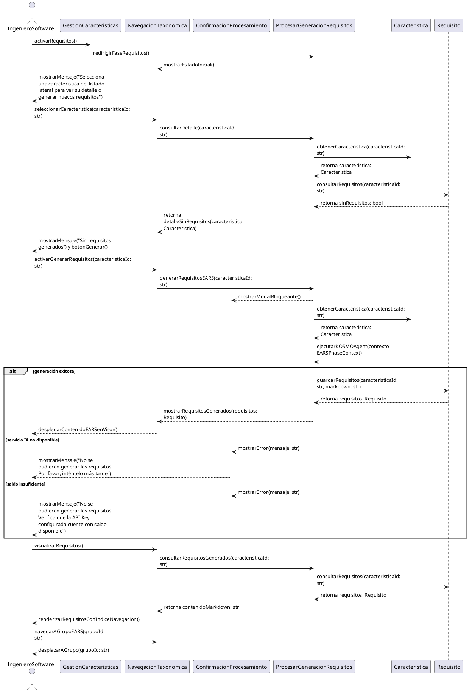

#### Leyenda de Contratos

| ID | Operación | Recibe | Retorna | Condición |
|----|-----------|--------|---------|-----------|
| B6 | GestionCaracteristicas | — | — | Principal |
| B8 | NavegacionTaxonomica | caracteristicaId: str (selección) caracteristicaId: str (generación) grupoId: str (navegación) | — | Principal |
| B4 | ConfirmacionProcesamiento | mensaje: str (error) | — | Generación en curso o fallo |
| C6 | ProcesarGeneracionRequisitos | caracteristicaId: str (generación) caracteristicaId: str (consulta) | caracteristica: Caracteristica requisitos: Requisito error: str contenidoMarkdown: str | Principal |
| E3 | Caracteristica | caracteristicaId: str (consulta) | caracteristica: Caracteristica | Principal |
| E4 | Requisito | caracteristicaId: str (consulta) caracteristicaId: str (guardado) | sinRequisitos: bool requisitos: Requisito | Principal |

---

### Matriz de Trazabilidad

| Tipo | Nombre | Tareas |
|------|--------|--------|
| Boundary | NavegacionTaxonomica | T6, T7 |
| Control | ProcesarGeneracionRequisitos | T3, T4 |
| Entity | Requisito | T1, T2, T5 |

---

### Tareas HU-09

| N° | Tarea | Horas Esfuerzo |
|----|-------|----------------|
| T1 | Definir entidad Requisito y RequirementRepository | 1H |
| T2 | Implementar RequirementRepository (SQLAlchemy) | 1H |
| T3 | Elaborar EARSMode y sus validadores | 3H |
| T4 | Desarrollar GenerateEARSUseCase | 1.5H |
| T5 | Exponer routers HTTP de requisitos | 2H |
| T6 | Construir panel PanelSelectorCaracteristicas | 2.5H |
| T7 | Construir panel VisorRequisitos con modal de generación bloqueante | 3.5H |

### Detalle de Tareas HU-09

| N° | Título | Descripción | Prioridad | Tipo de Actividad | Horas Esfuerzo |
|----|--------|-------------|-----------|-------------------|----------------|
| HU-09/T1 | Definir entidad Requisito y RequirementRepository | Definir en la capa de contratos la entidad que representa los requisitos generados para una característica, con su contenido estructurado bajo el estándar EARS. Incluir la clasificación de los patrones taxonómicos EARS aplicables. Definir el puerto del repositorio con las operaciones de persistencia y consulta por característica asociada. | 1 | Desarrollo | 1H |
| HU-09/T2 | Implementar RequirementRepository (SQLAlchemy) | Construir la implementación del repositorio en la capa de infraestructura utilizando el ORM del proyecto para persistir y consultar los requisitos generados. Implementar las operaciones definidas en el puerto con soporte asíncrono. | 1 | Desarrollo | 1H |
| HU-09/T3 | Elaborar EARSMode y sus validadores | Elaborar en la capa de dominio el modo de fase para requisitos, definiendo las instrucciones que guían a la IA para generar requisitos formales bajo el estándar EARS a partir de una característica. Especificar los patrones taxonómicos requeridos, la nomenclatura de identificación, los límites de cantidad y la inclusión de criterios de aceptación. Implementar la construcción del prompt de usuario con el documento de descubrimiento y los datos de la característica seleccionada. Desarrollar los validadores que verifican la sintaxis EARS de cada requisito, la calidad del conjunto generado y la ausencia de términos de implementación. | 1 | Desarrollo | 3H |
| HU-09/T4 | Desarrollar GenerateEARSUseCase | Implementar el caso de uso en la capa de aplicación que orquesta la generación de requisitos EARS para una característica seleccionada. Consultar los datos de la característica, delegar en el agente la generación a partir del contexto construido, validar la estructura del resultado y almacenar los requisitos generados. Gestionar los posibles fallos del servicio de IA durante el proceso. | 1 | Desarrollo | 1.5H |
| HU-09/T5 | Exponer routers HTTP de requisitos | Exponer los endpoints HTTP en la capa de infraestructura para la generación y consulta de requisitos. Configurar la autenticación requerida y la inyección del caso de uso correspondiente desde la composición de dependencias. | 2 | Desarrollo | 2H |
| HU-09/T6 | Construir panel PanelSelectorCaracteristicas | Construir el componente React PanelSelectorCaracteristicas que ocupa el panel izquierdo del layout dividido de la fase de requisitos. Listar verticalmente todas las características del proyecto, mostrando para cada ítem: el identificador visible (C01, C02...), el título de la característica y el número de requisitos asociados. Almacenar el identificador de la característica seleccionada en el estado local para que el panel derecho reaccione al cambio. Resaltar visualmente la característica activa. | 2 | Desarrollo | 2.5H |
| HU-09/T7 | Construir panel VisorRequisitos con modal de generación bloqueante | Construir el componente React VisorRequisitos que ocupa el panel derecho del layout dividido, soportando tres estados: (a) sin selección — muestra el mensaje "Selecciona una característica del listado lateral para ver su detalle o generar nuevos requisitos"; (b) característica seleccionada sin requisitos — muestra el identificador C0X, título y descripción de la característica, el mensaje "Sin requisitos generados" y un botón central [Generar]; (c) requisitos generados — renderiza el contenido markdown EARS en formato visual con un índice flotante de navegación que lista los grupos taxonómicos (Ubicuos, Event-driven, State-driven, Opcionales, Unwanted, Complex) permitiendo desplazarse entre requisitos mediante anclas. Al hacer clic en [Generar], desplegar un modal bloqueante que impide cualquier interacción con la interfaz durante el procesamiento de la IA. Al completar, cerrar el modal y transicionar al estado (c). En caso de error, mostrar dentro del modal los mensajes "No se pudieron generar los requisitos. Por favor, inténtelo más tarde" o "No se pudieron generar los requisitos. Verifica que la API Key configurada cuente con saldo disponible". | 2 | Desarrollo | 3.5H |

---

## Sprint Planning

### Resumen del Sprint

| Métrica | Valor |
|---|---|
| Total de Historias de Usuario | 5 |
| Total de Tareas Generadas | 43 |
| Capacidad del Sprint | 60H - 92H |

### Historias de Usuario del Sprint

| Prioridad | ID | Nombre | SP | Nro Tareas | Horas Esfuerzo |
|---|---|---|---|---|---|
| 1 | HU-01 | Nuevo proyecto | 5SP | 6 | 10.5H |
| 2 | HU-02 | Visualización del portafolio de proyectos | 3SP | 7 | 14H |
| 3 | HU-03 | Creación de la visión del producto software con IA | 8SP | 13 | 28.5H |
| 4 | HU-05 | Creación de las características del producto software con IA | 8SP | 7 | 14.5H |
| 5 | HU-06 | Explorar características del proyecto de software | 2SP | 3 | 5H |
| 6 | HU-09 | Creación de requisitos del producto software mediante IA | 8SP | 7 | 14.5H |
| **Total** | | | **34SP** | **43** | **87H** |

### Mapa de Dependencias

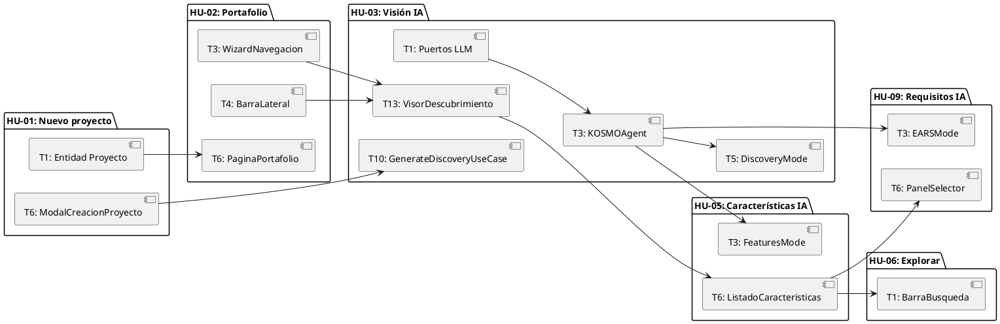

### Tabla de Dependencias Cruzadas

| Tarea | Depende de | HU Origen | HU Destino | Tipo de Dependencia |
|---|---|---|---|---|
| HU-02/T6 | HU-01/T1 | HU-01 | HU-02 | Técnica (entidad Proyecto compartida) |
| HU-03/T10 | HU-01/T6 | HU-01 | HU-03 | Secuencial (ModalCreacionProyecto invoca generación) |
| HU-03/T3 | HU-03/T1 | HU-03 | HU-03 | Técnica (KOSMOAgent requiere puerto LLMClient) |
| HU-03/T5 | HU-03/T3 | HU-03 | HU-03 | Técnica (DiscoveryMode consumido por KOSMOAgent) |
| HU-05/T3 | HU-03/T3 | HU-03 | HU-05 | Técnica (FeaturesMode consumido por KOSMOAgent) |
| HU-09/T3 | HU-03/T3 | HU-03 | HU-09 | Técnica (EARSMode consumido por KOSMOAgent) |
| HU-05/T6 | HU-03/T13 | HU-03 | HU-05 | Secuencial (se accede desde VisorDescubrimiento) |
| HU-06/T1 | HU-05/T6 | HU-05 | HU-06 | Integración (BarraBusqueda se integra en ListadoCaracteristicas) |
| HU-09/T6 | HU-05/T6 | HU-05 | HU-09 | Secuencial (se accede desde ListadoCaracteristicas) |
| HU-03/T13 | HU-02/T3 | HU-02 | HU-03 | Integración (VisorDescubrimiento dentro de AppLayout) |
| HU-03/T13 | HU-02/T4 | HU-02 | HU-03 | Integración (VisorDescubrimiento dentro de AppLayout) |

### Resumen del Sprint Backlog

| Historia de Usuario (HU) | T1 | T2 | T3 | T4 | T5 | T6 | T7 | T8 | T9 | T10 | T11 | T12 | T13 | Sum of Effort - Hours |
|---|---|---|---|---|---|---|---|---|---|---|---|---|---|---|
| HU-01 | 1.5H | 0.5H | 1.5H | 2H | 1.5H | 3.5H | | | | | | | | 10.5H |
| HU-02 | 1.5H | 1.5H | 2.5H | 3H | 2H | 3H | 0.5H | | | | | | | 14H |
| HU-03 | 2H | 1.5H | 3.5H | 2.5H | 2H | 1.5H | 2.5H | 2.5H | 1.5H | 1.5H | 2H | 2H | 3.5H | 28.5H |
| HU-05 | 1.5H | 1.5H | 2.5H | 2H | 2H | 2.5H | 2.5H | | | | | | | 14.5H |
| HU-06 | 1.5H | 1.5H | 2H | | | | | | | | | | | 5H |
| HU-09 | 1H | 1H | 3H | 1.5H | 2H | 2.5H | 3.5H | | | | | | | 14.5H |
| **Total Sum of Effort – Hours Estimates** | | | | | | | | | | | | | | **87H** |

| Historia de Usuario (HU) | Story Point (SP) |
|---|---|
| HU-01 | 5SP |
| HU-02 | 3SP |
| HU-03 | 8SP |
| HU-05 | 8SP |
| HU-06 | 2SP |
| HU-09 | 8SP |
| **Suma total de SP** | **34SP** |
